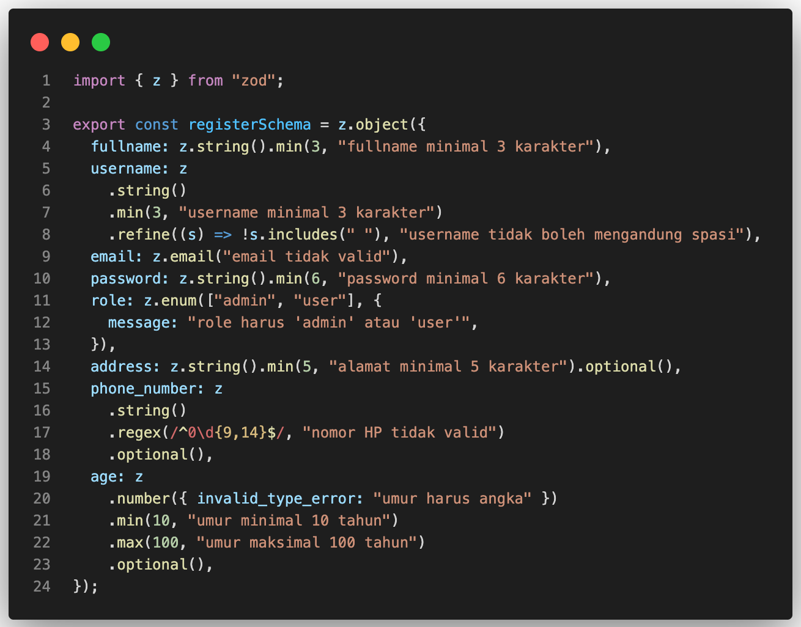
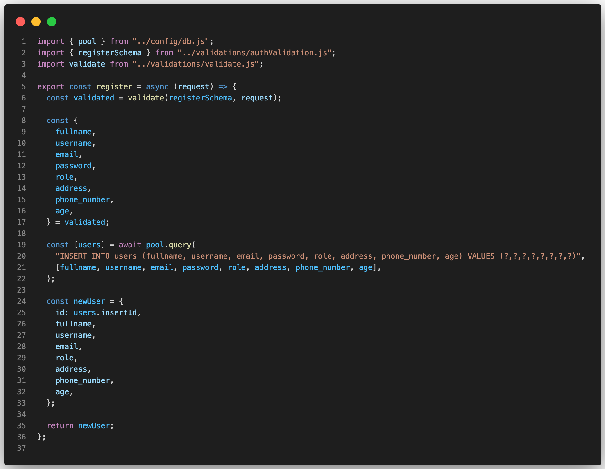
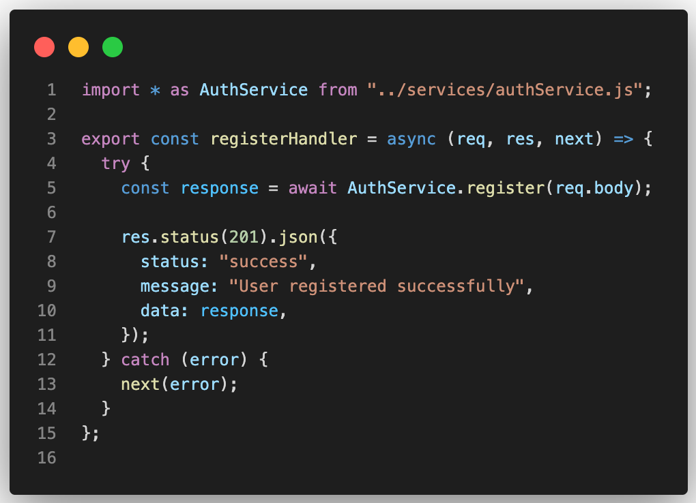
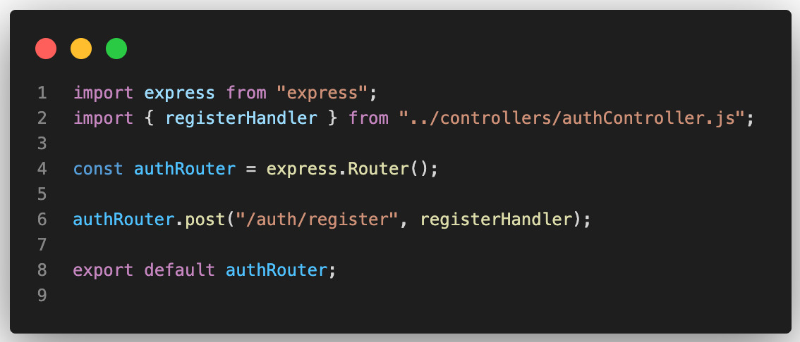
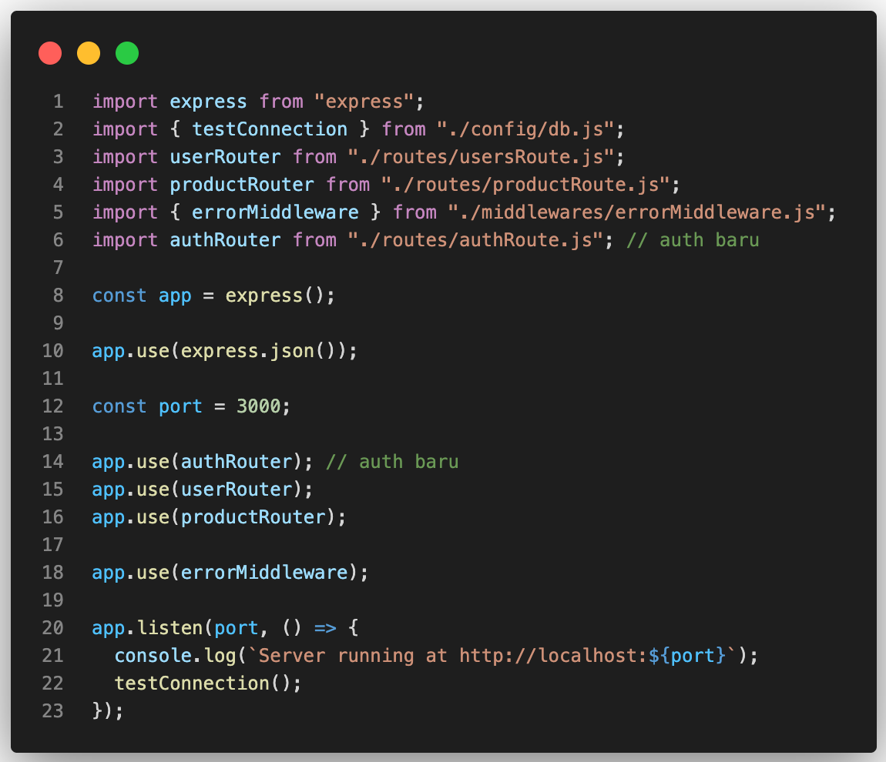

# Step 4: Setup Service, Controller, dan Validasi untuk Authentication

Di step ini, kita akan membuat **struktur dasar untuk fitur Authentication (Register)**.  
Tujuannya:

1. Memperkenalkan pola **Controller–Service–Validation** pada fitur Auth.
2. Membuat **endpoint `/auth/register`** yang bisa menerima input user dan menyimpan ke database.
3. Menunjukkan cara menggunakan **Zod untuk validasi input** agar data user yang masuk sesuai aturan.

💡 Catatan:

> Saat ini kita **belum menggunakan password hashing atau JWT**. Fokus di step ini adalah **memahami pola arsitektur** yang konsisten, sehingga nanti ketika kita menambahkan hashing atau token, kodenya tetap rapi dan mudah dikembangkan.

---

## 1️⃣ Buat Schema Validasi dengan Zod (`authValidation.js`)

`src/validations/authValidation.js`:



## 2️⃣ Buat Service Authentication (`authService.js`)

`src/services/authService.js`:



> 💡 Catatan: Belum ada hashing password. Fokus di logika insert user dan validasi input.

## 3️⃣ Buat Controller Authentication (`authController.js`)

`src/controllers/authController.js`:



## 4️⃣ Buat Route Authentication (`authRoute.js`)

`src/routes/authRoute.js`:



## 5️⃣ Update (`server.js`)



## 6️⃣ Contoh Test Postman

- Endpoint: `POST http://localhost:3000/auth/register`
- Headers: `Content-Type: application/json`

- Body `Valid`:

```json
{
  "fullname": "Agung Santoso",
  "username": "agungsantoso",
  "email": "agung@example.com",
  "password": "123456",
  "role": "user",
  "address": "Jl. Merdeka No.10",
  "phone_number": "081234567890",
  "age": 25
}
```

- Response `201`:

```json
{
  "status": "success",
  "data": {
    "id": 7,
    "fullname": "Agung Santoso",
    "username": "agungsantoso",
    "email": "agung@example.com",
    "role": "user",
    "address": "Jl. Merdeka No.10",
    "phone_number": "081234567890",
    "age": 25
  }
}
```

- Body Tidak Valid `(username ada spasi)`:

```json
{
  "fullname": "Agung Santoso",
  "username": "agungsantoso a",
  "email": "agung@example.com",
  "password": "123456",
  "role": "user",
  "address": "Jl. Merdeka No.10",
  "phone_number": "081234567890",
  "age": 25
}
```

- Response `400`:

```json
{
  "status": "fail",
  "message": "username tidak boleh ada spasi"
}
```

## ✅ Kesimpulan:

- Menyiapkan Service–Controller–Validation untuk Authentication.
- Endpoint `/auth/register` siap menerima request dan menyimpan data ke database.
- Belum ada `bcrypt / JWT`, fokus pada struktur kode dan pola arsitektur.
- Step berikutnya bisa menambahkan password hashing dan JWT token tanpa mengubah struktur dasar ini.
