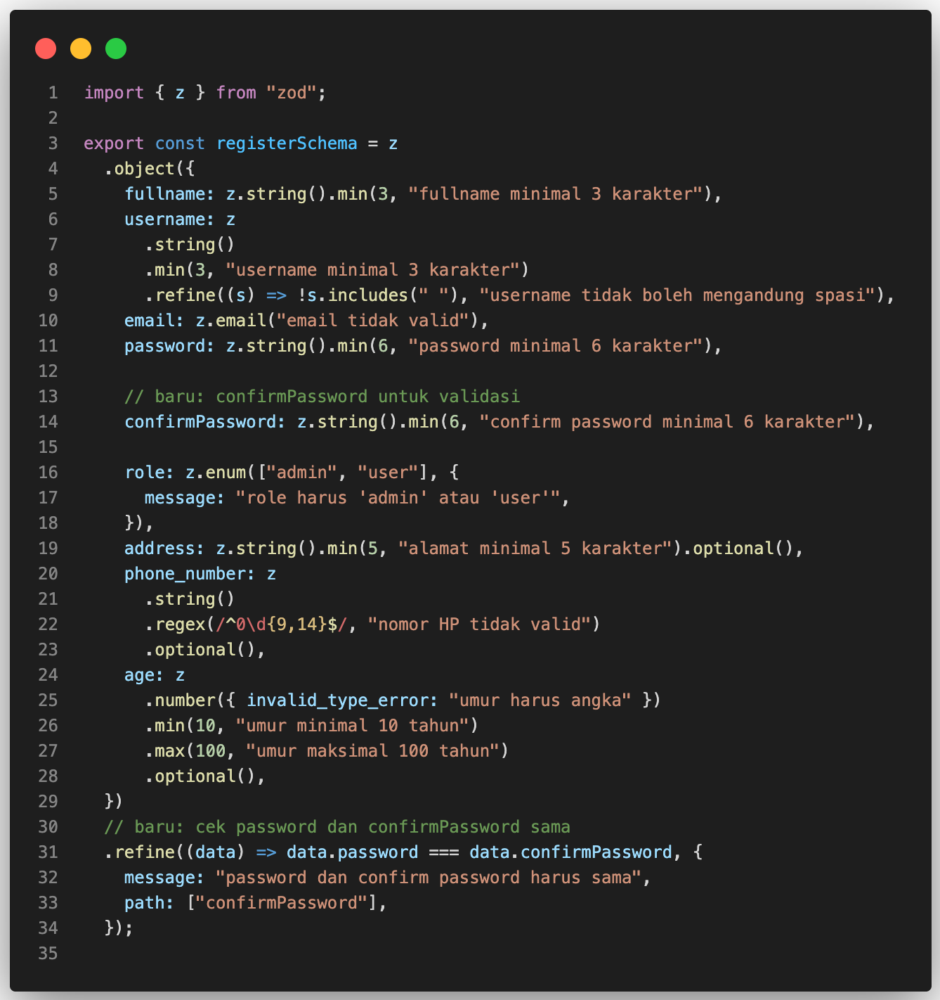
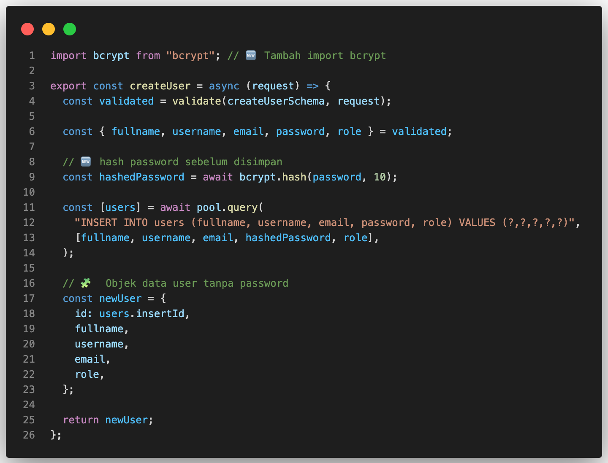
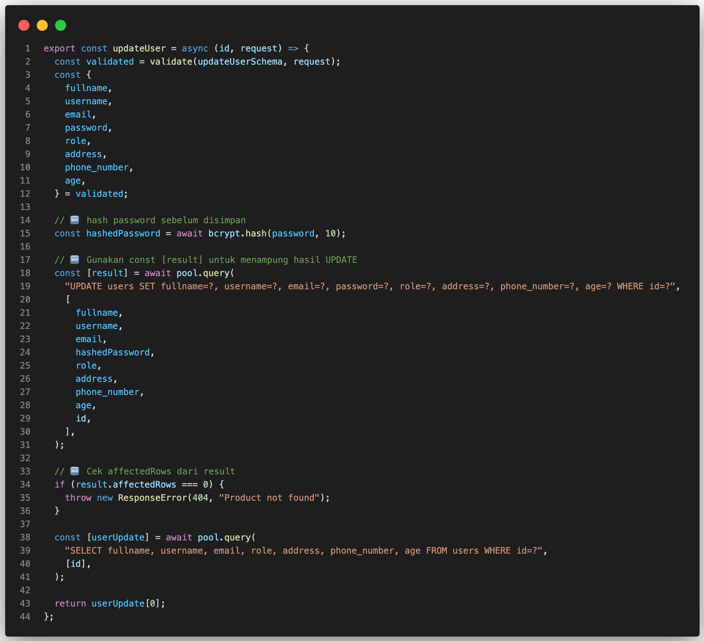

# Step 5: Hash Password dengan bcrypt + Validasi Confirm Password

Di step ini, kita akan menambahkan password hashing menggunakan bcrypt. Selain itu, kita juga bisa menambahkan confirm password untuk memvalidasi bahwa user mengetik password yang sama dua kali.

💡 Tujuan:

1. Password tidak disimpan **plain text** di database → lebih aman.
2. Menambahkan validasi `confirm password` agar user tidak salah ketik.
3. Struktur `Service–Controller–Validation` tetap sama → controller dan route tidak berubah.

## 1️⃣ Install bcrypt

Sebelum mulai hashing, install package bcrypt:

```bash
npm install bcrypt
```

Penjelasan:

> `bcrypt` digunakan untuk mengubah password menjadi hash sehingga lebih aman. Password hash yang tersimpan di database tidak bisa dibaca langsung oleh orang lain.

## 2️⃣ Update Schema Validasi (`authValidation.js`)

Sekarang kita menambahkan **confirmPassword** di schema Zod untuk memastikan user mengetik password yang sama dua kali.



## 3️⃣ Update Service (`authService.js`)

Sekarang kita hash password sebelum disimpan ke database.


## 4️⃣ Tambahkan Hash Password di (`userService.js`)

Di bagian ini, kita menambahkan proses `hash password` menggunakan bcrypt pada fitur `Create User` dan `Update User` di file userService.js.

Agar password yang dibuat atau diubah lewat modul user juga disimpan dalam bentuk hash, bukan `plain text` — sama seperti proses register sebelumnya.

Buka file `src/services/userService.js`, dan terapkan hash password:

### a. Update `createUser`



### a. Update `updateUser`



## ✅ Kesimpulan:

- Password tidak lagi disimpan dalam `plain text`, tapi di-hash menggunakan `bcrypt`.
- Validasi **confirm password** memastikan user tidak salah ketik **password** saat register.
- Fungsi `createUser` dan `updateUser` sudah meng-hash password sebelum simpan ke **database**.
- Response API tidak mengembalikan password, tetap aman.
- Cek `affectedRows` pada **UPDATE** memastikan API mengembalikan error jika user ID tidak ditemukan.
