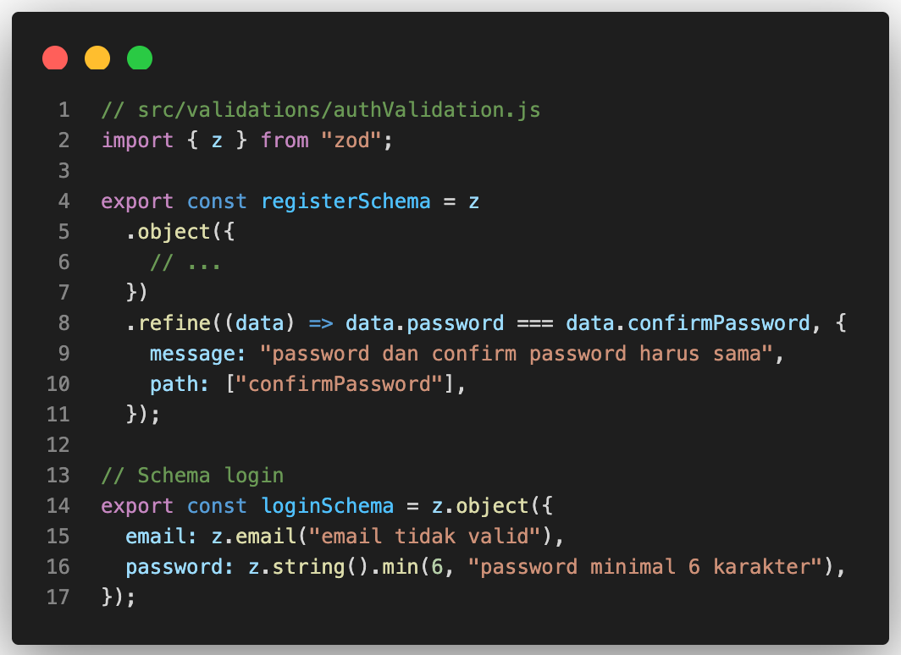
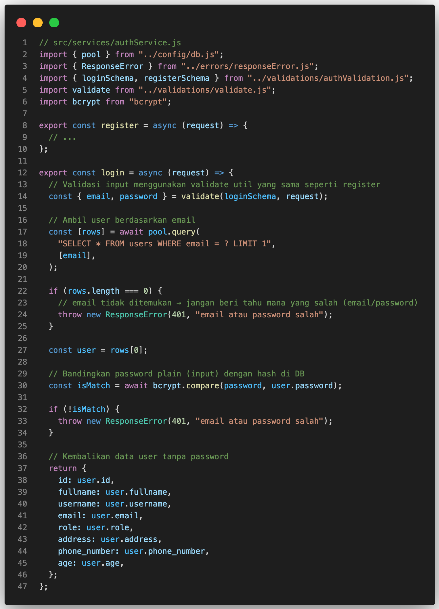
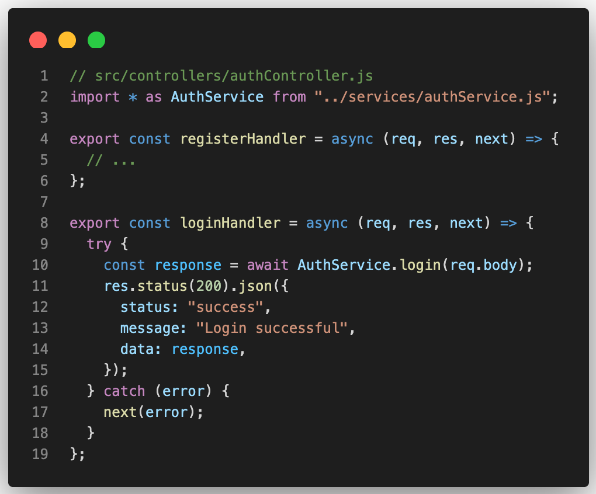

# Step 5: Menambahkan Endpoint Login

Di step ini kita menambahkan endpoint login untuk melengkapi fitur register yang sudah ada.
Tujuannya:

1. Menyediakan endpoint `/auth/login` yang menerima `email` + `password`.
2. Memvalidasi input dengan `loginSchema` (Zod).
3. Membandingkan password menggunakan `bcrypt.compare`.
4. Mengembalikan data user (tanpa password) atau error 401 bila gagal.

> Catatan: Pada step ini kita belum menambahkan `JWT` atau `cookie`. Fokus: membuat endpoint login yang aman memeriksa password (hash) dan mengembalikan data user.

## 1️⃣ Validasi Input (authValidation.js)

Sebelum mulai hashing, install package bcrypt:
Buka `authValidation.js` dan tambahkan loginSchema seperti ini:



> ✅ Pastikan `loginSchema` diekspor agar service login bisa menggunakan schema ini.

## 2️⃣ Service: Implementasi login (`authService.js`)

Tambahkan method login di file `authService.js` seperti ini:



Penjelasan singkat:

- `validate(loginSchema, request)` memastikan input sesuai aturan.

- `bcrypt.compare` membandingkan password input dengan hash yang tersimpan.

- Error 401 dikembalikan bila email tidak ada atau password salah (sama pesan untuk menghindari info berlebih).

## 3️⃣ Controller: Tambahkan loginHandler (`authController.js`)

Tambahkan controller untuk handle login yang memanggil service di file `authController.js`:



Penjelasan:

- Controller memanggil `service login` dan mengembalikan JSON response.
- Controller tidak berisi logic yang berat, hanya menjadi “penghubung”.

## 4️⃣ Route: Daftarkan endpoint (`authRoute.js`)

Bukan file `authRoute.js` dan pastikan untuk menambahkan `POST /auth/login`:


Penjelasan:

- Router menentukan URL untuk endpoint login.
- `POST /auth/login` → akan menjalankan function `loginHandler`.

## 5️⃣ Contoh Test Postman

- Endpoint: `POST http://localhost:3000/auth/login`
- Headers: `Content-Type: application/json`

- Body `Valid` (email + password benar):

```json
{
  "email": "agung@example.com",
  "password": "123456"
}
```

- Response `200` (Sukses):

```json
{
  "status": "success",
  "message": "Login successful",
  "data": {
    "id": 7,
    "fullname": "Agung Santoso",
    "username": "agungsantoso",
    "email": "agung@example.com",
    "role": "user",
    "address": "Jl. Merdeka No.10",
    "phone_number": "081234567890",
    "age": 25
  }
}
```

- Body `Invalid` (email tidak terdaftar / password salah)

```json
{
  "email": "salah@example.com",
  "password": "123456"
}
```

- Response `401` (Unauthorized)::

```json
{
  "status": "fail",
  "message": "email atau password salah"
}
```

> Catatan: Pesan sama untuk email/password salah, demi keamanan agar tidak memberi tahu info detail.

- Body `Invalid` (format email salah / password terlalu pendek)

```json
{
  "email": "agung",
  "password": "123"
}
```

- Response `400` (Bad Request):

```json
{
  "status": "fail",
  "message": "email tidak valid"
}
```

> Catatan: Validasi input dilakukan oleh loginSchema (Zod) sebelum query ke database.

## ✅ Kesimpulan:

- Endpoint `/auth/login` sudah tersedia.
- Input divalidasi dengan Zod `(loginSchema)`.
- Password dibandingkan dengan `bcrypt.compare`.
- Error `401` untuk login gagal, `400` untuk input tidak valid.
- Response sukses hanya mengembalikan data user tanpa password.
- Controller hanya sebagai penghubung → logic ada di service.
- Struktur `Service–Controller–Validation` tetap rapi → mudah dikembangkan.
- Step selanjutnya bisa menambahkan `JWT` + `cookie httpOnly` agar user bisa login dengan token aman.
